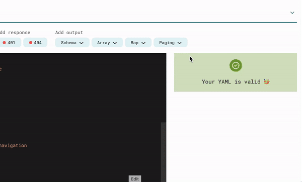
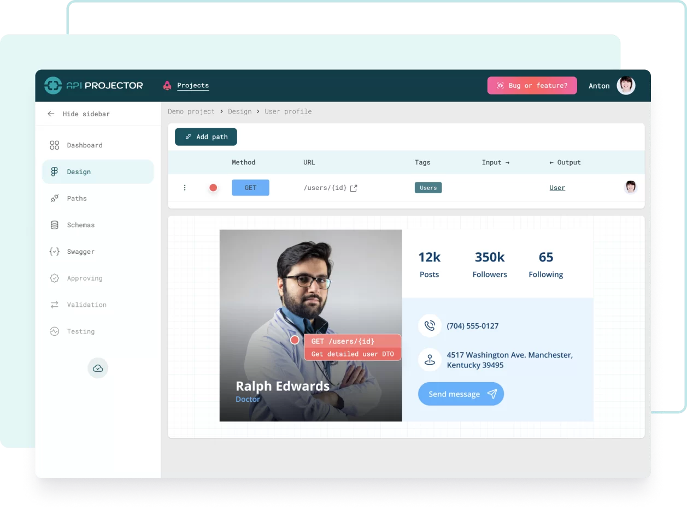
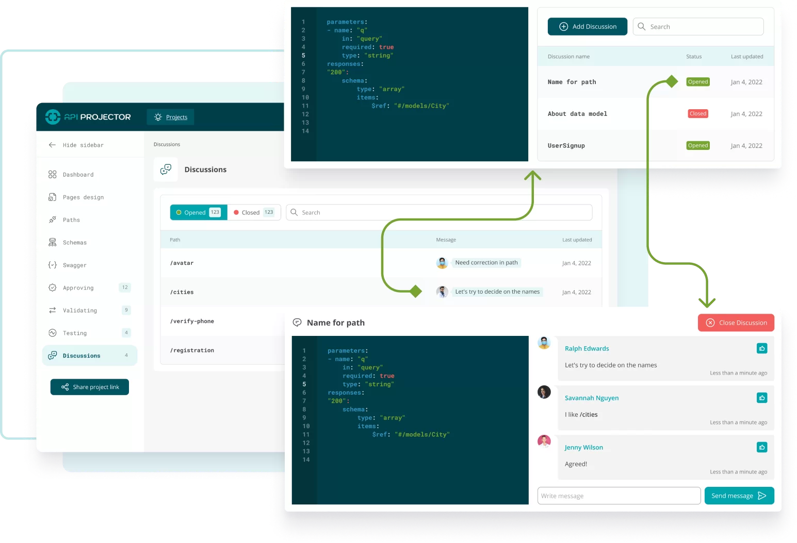
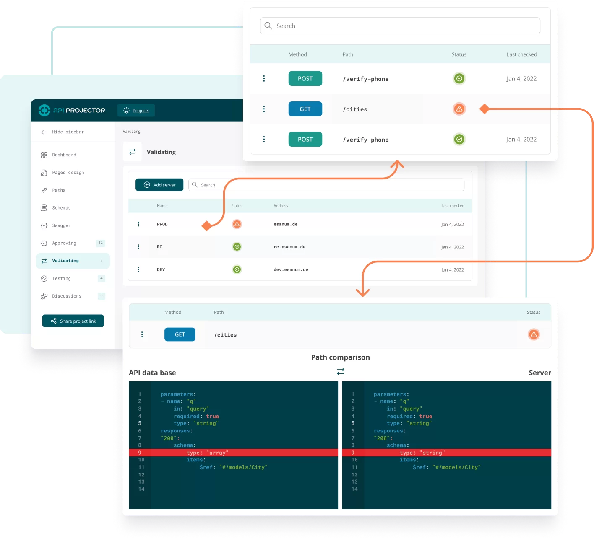
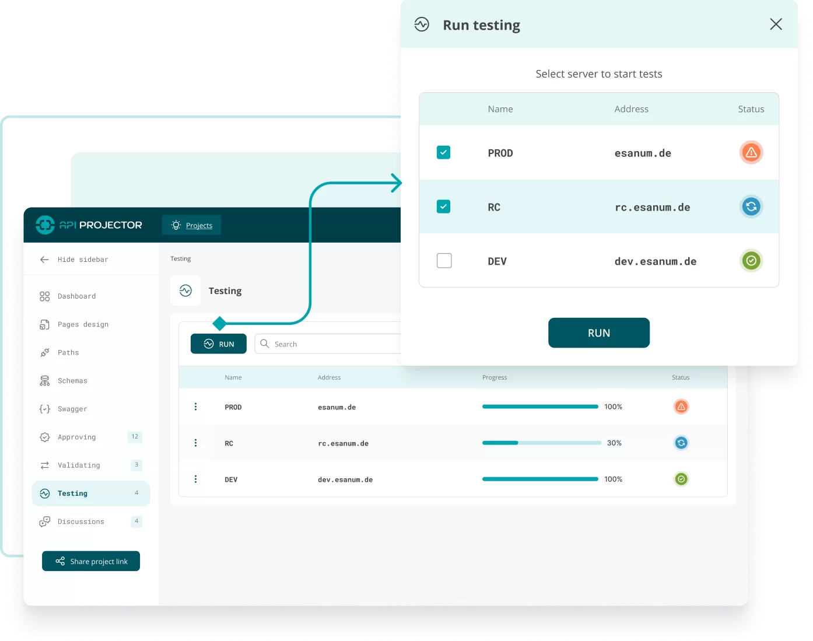

# Visual 🥳 Swagger Editor for Teams

Get full power of [Spec-First](https://oai.github.io/Documentation/specification.html) approach in your team for API
contracts ❤️

See more information about product on [our landing](https://apiprojector.com/)

# Features

## Link API to app design

Who is needed a data from your API? Right, for UI. Save time of your back-end developers, allow make a drafts API by
front-end developers based on UI. Upload UI screens from Figma, link API requests and data scheme in visual mode.

## Collaborate front-end & back-end teams

Send API contracts for discussing and approving to the back-end. Discuss, fix, approve before coding and start working
in parallel on front-end and back-end!

## Validate API contracts on real server

Check API contracts after implementing on real server. Get notification when contract is broken or changed. Save time
for finding bugs! Front-end & back-end are synced.

## Run API auto tests in two clicks

Improve your API contracts and find narrow places in your server. Generate & run automated tests for data scheme,
security issues, etc. in two clicks.

Yes, it is an open source ❤️

# How to deploy

Coming soon, check https://github.com/api-projector/api-projector/issues/2

# How to collaborate

Be free to suggest your pull requests to product's components:
* [Angular Frontend](https://github.com/api-projector/frontend)
* [Python Django Backend](https://github.com/api-projector/backend)
* [CouchDB proxy](https://github.com/api-projector/couchdb-proxy)

Report bugs 🐞 or request features 😻 on [GitHub](https://github.com/api-projector/api-projector/issues)

# How to help us?

Vote for our project 👇

Comment our articles on Habr:
* [I am frontend developer, not a monkey](https://habr.com/ru/post/599127/)  | 02.01.2022 [breslavsky](https://github.com/breslavsky) 3.2k views
* [Bugs on Habr or 500 it is ok?](https://habr.com/ru/post/647957/)  | 26.01.2022 [breslavsky](https://github.com/breslavsky) 33k views
